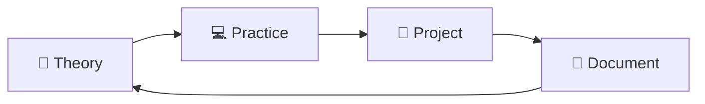

<div align="center">

# 📊 Basic Data Science for Machine Learning

### *A modular roadmap to master **NumPy**, **Pandas**, and **SQL***


---

</div>

## 🧭 Navigation

<details>
<summary><b>📋 Table of Contents</b></summary>
<br>

1. [🎯 Overview](#-overview)
2. [📂 Project Structure](#-project-structure)  
3. [🔧 Technology Stack](#-technology-stack--requirements)
4. [📅 Study Timeline](#-study-timeline)
5. [💡 Best Practices](#-best-practices)
6. [🚀 Getting Started](#-getting-started)
7. [📚 Modules & Details](#-modules--details)
8. [📄 License](#-license)
9. [👨‍💻 Credits](#-credits)

</details>

---

## 🎯 Overview

> *Transform your data science journey with structured, hands-on learning*

This repository provides a **comprehensive, modular roadmap** to master core data science skills using NumPy, Pandas, and SQL — perfectly designed for machine learning preparation.

### 🌟 **Why This Repository?**

| 🎯 **Goal** | 📖 **What You Get** |
|-------------|---------------------|
| **Structured Learning** | Step-by-step notebooks with clear progression |
| **Hands-on Practice** | Real datasets and practical exercises |
| **Modular Design** | Learn at your own pace, mix and match topics |
| **ML Ready** | Skills directly applicable to machine learning |

---

## 📂 Project Structure

```
📦 Basic_DataScience_4ML/
├── 🗂️ assets/
│   └── 📊 data/
│       └── 📁 static/
├── 🔬 data prepare/
│   ├── 📈 EDA/                    # Exploratory Data Analysis
│   │   ├── 📋 report.html
│   │   ├── 📓 phase_1.ipynb
│   │   ├── 📓 phase_2.ipynb
│   │   ├── 📓 phase_3.ipynb
│   │   └── 📊 boxplot.png
│   ├── ⚙️ Feature engineering/     # Transform & Select Features
│   │   ├── 📓 phase_1.ipynb
│   │   ├── 📓 phase_2.ipynb
│   │   └── 📓 phase_3.ipynb
│   ├── 🧹 Preprocessing/           # Clean & Prepare Data
│   │   └── 📓 phase_1.ipynb
│   └── 📊 Visualization/           # Data Visualization
│       ├── 📓 phase_1.ipynb
│       ├── 📓 phase_2.ipynb
│       └── 📓 phase_3.ipynb
├── 🔢 numpy/                       # Numerical Computing
│   ├── 📓 Phase_1.ipynb
│   ├── 📓 Phase_2.ipynb
│   └── 📓 Phase_3.ipynb
├── 🐼 pandas/                      # Data Manipulation
│   ├── 📓 Phase_1.ipynb
│   ├── 📓 phase_2.ipynb
│   └── 📓 phase_3.ipynb
├── 🗄️ sql/                        # Database Queries
│   ├── 📄 Phase_1.sql
│   ├── 📄 Phase_2.sql
│   ├── 📄 Phase_3.sql
│   └── 📓 rough.ipynb
├── 📚 External Libraries/
├── 📋 requirements.txt
└── 📖 README.md
```

---

## 🔧 Technology Stack & Requirements

<div align="center">

### 🛠️ **Core Technologies**

| Technology | Version | Purpose |
|------------|---------|---------|
| 🐍 **Python** | ≥ 3.8 | Core programming language |
| 🔢 **NumPy** | Latest | Numerical computing & arrays |
| 🐼 **Pandas** | Latest | Data manipulation & analysis |
| 🗄️ **SQLite/SQL** | Latest | Database operations |
| 📓 **Jupyter** | Latest | Interactive notebooks |

</div>

### ⚡ **Quick Setup**

```bash
# Clone the repository
git clone https://github.com/Obiwankenobi699/Basic_DataScience-4ML.git

# Navigate to project
cd Basic_DataScience-4ML

# Install dependencies
pip install -r requirements.txt

# Launch Jupyter
jupyter notebook
```

---

## 📅 Study Timeline

<div align="center">

### 🗓️ **6-Week Intensive Roadmap**

</div>

| 📅 **Week** | 🎯 **Focus Area** | 📚 **Key Concepts** | 🎪 **Mini Project** |
|-------------|-------------------|---------------------|---------------------|
| **Week 1** | 🔢 **NumPy Foundations** | Arrays, Shapes, Indexing, Slicing | 📐 Vector Math Calculator |
| **Week 2** | ⚡ **NumPy Advanced** | Broadcasting, Dot Products, Linear Algebra | 🧮 Matrix Operations Demo |
| **Week 3** | 🐼 **Pandas Basics** | Series, DataFrames, Basic Operations | 📊 CSV Data Explorer |
| **Week 4** | 🚀 **Pandas Pro** | GroupBy, Merging, Advanced Aggregation | 💰 Sales Analytics Dashboard |
| **Week 5** | 🗄️ **SQL Fundamentals** | SELECT, WHERE, ORDER BY, Basic Joins | 🔍 Query Practice Lab |
| **Week 6** | 💎 **SQL Mastery** | Complex Joins, Subqueries, Window Functions | 🏢 Business Intelligence Case Study |

> **💡 Tip:** *Modules are designed to be flexible - learn at your own pace!*

---

## 💡 Best Practices

<div align="center">

### 🌟 **Golden Rules for Data Science Success**

</div>

| 🛠️ **Library** | 💡 **Best Practice** | 🚨 **Avoid This** |
|----------------|----------------------|-------------------|
| 🔢 **NumPy** | Use vectorized operations for speed | Avoid Python loops with arrays |
| 🐼 **Pandas** | Start with `df.info()` & `df.describe()` | Don't skip data exploration |
| 🗄️ **SQL** | Begin with simple queries, build complexity | Don't write complex joins immediately |
| 📊 **General** | Document your analysis process | Don't skip comments in notebooks |

### 🎯 **Learning Strategy**



---

## 🚀 Getting Started

### 🎬 **Quick Start Guide**

<details>
<summary><b>🔧 Environment Setup</b></summary>

1. **Prerequisites Check**
   ```bash
   python --version  # Should be 3.8+
   pip --version     # Should be latest
   ```

2. **Clone Repository**
   ```bash
   git clone https://github.com/Obiwankenobi699/Basic_DataScience-4ML.git
   cd Basic_DataScience-4ML
   ```

3. **Setup Virtual Environment** *(Recommended)*
   ```bash
   python -m venv venv
   source venv/bin/activate  # Linux/Mac
   # OR
   venv\Scripts\activate     # Windows
   ```

4. **Install Dependencies**
   ```bash
   pip install -r requirements.txt
   ```

</details>

<details>
<summary><b>📓 Launch Jupyter</b></summary>

```bash
# Start Jupyter Notebook
jupyter notebook

# OR start Jupyter Lab (recommended)
jupyter lab
```

Navigate to the folder structure and start with `numpy/Phase_1.ipynb`

</details>

<details>
<summary><b>🗄️ SQL Setup</b></summary>

- **Option 1:** Use SQLite (built-in with Python)
- **Option 2:** Install DB Browser for SQLite (GUI)
- **Option 3:** Use your preferred SQL client

</details>

---

## 📚 Modules & Details

<div align="center">

### 🎓 **Learning Modules Overview**

</div>

| 📂 **Module** | 🎯 **Learning Goals** | 🛠️ **Tools Used** | ⏱️ **Time Investment** |
|---------------|------------------------|-------------------|------------------------|
| 🔬 **EDA** | Master exploratory analysis, statistical summaries | Pandas, Matplotlib, Seaborn | 1-2 weeks |
| ⚙️ **Feature Engineering** | Transform data, create meaningful features | Pandas, NumPy, Scikit-learn | 1-2 weeks |
| 🧹 **Preprocessing** | Clean data, handle missing values, scaling | Pandas, NumPy | 1 week |
| 📊 **Visualization** | Create compelling charts and plots | Matplotlib, Seaborn, Plotly | 1-2 weeks |
| 🔢 **NumPy** | Array operations, mathematical computations | NumPy | 2 weeks |
| 🐼 **Pandas** | Data manipulation, analysis workflows | Pandas | 2-3 weeks |
| 🗄️ **SQL** | Database queries, data retrieval | SQLite, SQL | 2 weeks |

### 🎯 **Module Deep Dive**

<details>
<summary><b>🔬 EDA (Exploratory Data Analysis)</b></summary>

- **Phase 1:** Basic statistics and data overview
- **Phase 2:** Distribution analysis and correlation
- **Phase 3:** Advanced patterns and outlier detection
- **Deliverable:** Interactive HTML reports

</details>

<details>
<summary><b>⚙️ Feature Engineering</b></summary>

- **Phase 1:** Feature creation and transformation
- **Phase 2:** Feature selection techniques
- **Phase 3:** Advanced feature engineering
- **Deliverable:** Optimized feature sets

</details>

<details>
<summary><b>🔢 NumPy Mastery</b></summary>

- **Phase 1:** Array fundamentals and indexing
- **Phase 2:** Mathematical operations and broadcasting
- **Phase 3:** Linear algebra and advanced operations
- **Deliverable:** High-performance numerical solutions

</details>

---

## 📄 License

<div align="center">

**📜 MIT License**

This project is open source and available under the [MIT License](LICENSE).

*Feel free to fork, modify, and use in academic or commercial projects!*

</div>

---

## 👨‍💻 Credits

<div align="center">

### 🌟 **Created with ❤️ by**

**[Obiwankenobi699](https://github.com/Obiwankenobi699)**

---

### 🤝 **Contributing**

We welcome contributions! Here's how you can help:

| 🎯 **Type** | 📝 **Description** |
|-------------|-------------------|
| 🐛 **Bug Reports** | Found an issue? Open a GitHub issue |
| 💡 **Feature Requests** | Have an idea? We'd love to hear it! |
| 📖 **Documentation** | Help improve our docs |
| 💻 **Code** | Submit pull requests with improvements |

### 📞 **Get in Touch**

[](https://github.com/Obiwankenobi699)
[](https://github.com/Obiwankenobi699/Basic_DataScience-4ML/issues)
[](https://github.com/Obiwankenobi699/Basic_DataScience-4ML/pulls)

</div>

---

<div align="center">

### 🎉 **Ready to Start Your Data Science Journey?**

**[⚡ Get Started Now](https://github.com/Obiwankenobi699/Basic_DataScience-4ML) | [📚 View Notebooks](https://github.com/Obiwankenobi699/Basic_DataScience-4ML/tree/main) | [💬 Join Discussion](https://github.com/Obiwankenobi699/Basic_DataScience-4ML/discussions)**

---

***Happy Learning & Coding!*** 🚀📊✨

*"Data is the new oil, but without the right tools, it's just crude."*

</div>